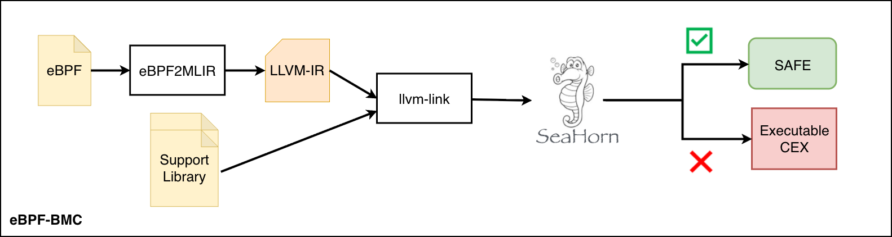
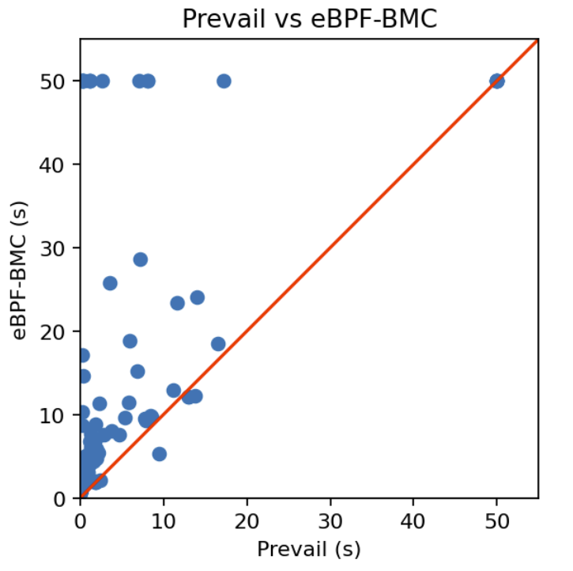
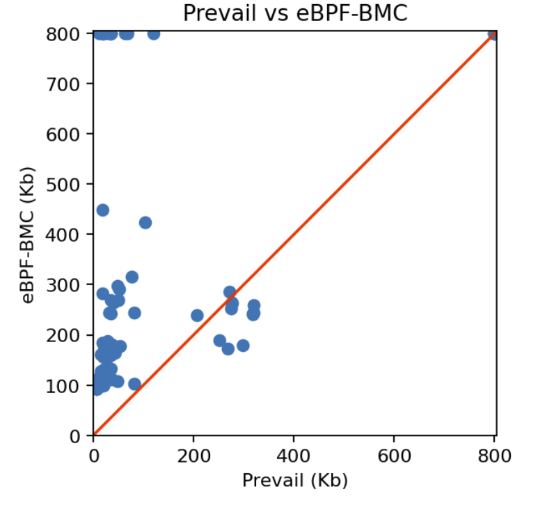

# eBPF-BMC: Bounded Model Checking for eBPF Programs


eBPF-BMC is a verification toolchain that applies bounded model checking to eBPF programs via MLIR and LLVM. When verification succeeds, the program is memory-safe under the given bounds. When verification fails, eBPF-BMC produces an **executable counterexample** — a standalone binary that concretely witnesses the violation and can be debugged with standard tools (lldb, gdb).

## Architecture



The pipeline:
1. **eBPF2MLIR** — translates eBPF bytecode (`.o`) into the eBPF Dialect of MLIR
2. **Analysis & Lowering** — runs type inference, inlining, and memory resolution passes, then converts to LLVM Dialect
3. **LLVM-IR Generation** — emits LLVM-IR from the LLVM Dialect
4. **llvm-link** — links the generated IR with helper function summaries (a support library modeling Linux eBPF helpers)
5. **SeaHorn** — performs bounded model checking; reports SAFE or produces an executable counterexample

## Motivating Example

Consider a program that performs a path-sensitive packet access — a common pattern in industrial eBPF code (e.g., Cilium):

```c
SEC("xdp")
int xdp_prog(xdp_md_t *ctx) {
    unsigned long key = 0;
    unsigned long *value = bpf_map_lookup_elem(&map, &key);
    ETH_HEADER *header = NULL;
    void* data = (void *)(long)ctx->data;
    void* data_end = (void *)(long)ctx->data_end;
    if ((data_end - data) >= sizeof(ETH_HEADER)){
        header = (void *)(long)ctx->data;
    }
    if (!value) { goto Exit; }
    if (header == NULL){ goto Exit; }
    return header->Type;
  Exit:
    return 0;
}
```

Prevail (abstract interpretation) conservatively rejects this program because it cannot track the path-sensitive relationship between the bounds check and the pointer assignment. eBPF-BMC verifies it as safe by evaluating each path independently.

## Usage

Given an eBPF object file `program.o` with section `xdp` and function `xdp_prog`:

```sh
# 1. Translate eBPF bytecode to eBPF Dialect
ebpf2mlir-translate --import-ebpf-mem --section xdp --function xdp_prog program.o > program.mlir

# 2. Run analysis passes (inline, resolve memory, type inference)
ebpf2mlir-opt --inline --resolve-mem program.mlir > program.res.mlir

# 3. Lower to LLVM Dialect
ebpf2mlir-opt --convert-ebpf-to-llvm --reconcile-unrealized-casts program.res.mlir > program.opt

# 4. Emit LLVM-IR
ebpf2mlir-translate --mlir-to-llvmir program.opt > program.ll

# 5. Link with helper summaries
llvm-link program.ll helper_summaries.ll -S -o program.linked.ll

# 6. Verify with SeaHorn
sea yama -y sea-cex.yaml fpf program.linked.ll
```

A convenience script is provided at [`utils/ebpf/script.sh`](utils/ebpf/script.sh).

## Counterexample Debugging

When SeaHorn finds a memory safety violation, the counterexample is materialized as a standalone executable. Developers can inspect it with standard debuggers:

```
(lldb) target create "bad_correlated.out"
Current executable set to 'bad_correlated.out' (x86_64).
(lldb) r
Process 2545146 stopped
* thread #1, stop reason = signal SIGSEGV: address not mapped to object (fault address: 0xc)
  frame #0: bad_correlated.out`main at bad_correlated.o.xdp.mlir.opt:164:12
   161    %125 = llvm.bitcast %18 : !llvm.ptr<i8> to !llvm.ptr<ptr<i8>>
   162    %126 = llvm.load %125 : !llvm.ptr<ptr<i8>>
   163    %127 = llvm.bitcast %126 : !llvm.ptr<i8> to !llvm.ptr<i16>
-> 164    %128 = llvm.load %127 : !llvm.ptr<i16>
```

The SIGSEGV directly localizes the failing memory access, providing actionable feedback that developers can trace back to their source program.

## Evaluation

We evaluate eBPF-BMC on **136 eBPF programs** from the [Cilium](https://cilium.io/) project — real-world packet processing and load-balancing logic. We compare against [Prevail](https://github.com/vbpf/ebpf-verifier), a state-of-the-art abstract interpretation verifier for eBPF.

**Key findings:**
- No verification task exceeded 30 seconds of runtime or 500 KB of peak memory
- Prevail conservatively rejects 9 programs due to imprecision in path-dependent memory accesses; eBPF-BMC verifies all 9 as safe
- When safety is violated, eBPF-BMC produces executable counterexamples that can be debugged with lldb/gdb

| | Prevail | eBPF-BMC |
|---|---|---|
| Verified safe | 127 | 136 |
| Rejected (false positive) | 9 | 0 |
| Executable counterexamples | No | Yes |

**Runtime comparison:**



**Memory comparison:**



Detailed analysis is available in the [results notebook](https://github.com/jetafese/btor2mlir/blob/ebpf/utils/ebpf/results/ebpf_results.ipynb).

## Prerequisites

- [LLVM/MLIR](https://github.com/llvm/llvm-project) (tested with LLVM 14)
- [SeaHorn](https://github.com/seahorn/seahorn) (provides SeaBMC)
- [Prevail](https://github.com/vbpf/ebpf-verifier) (for benchmarking; optional for standalone use)
- CMake, Clang/Clang++, Ninja

## Building

```sh
mkdir build && cd build
cmake -G Ninja .. \
    -DMLIR_DIR=$LLVM_PROJECT/build/lib/cmake/mlir \
    -DLLVM_DIR=$LLVM_PROJECT/build/lib/cmake/llvm \
    -DLLVM_EXTERNAL_LIT=$(which lit) \
    -DCMAKE_C_COMPILER=clang \
    -DCMAKE_CXX_COMPILER=clang++
ninja
```

This produces the `ebpf2mlir-translate` and `ebpf2mlir-opt` binaries under `build/bin/`.

## Contributors

Arie Gurfinkel <arie.gurfinkel@uwaterloo.ca>
Joseph Tafese <jetafese@uwaterloo.ca>
